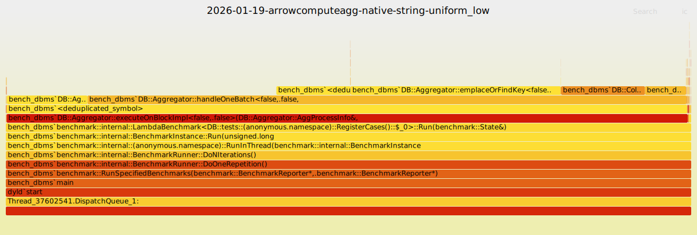
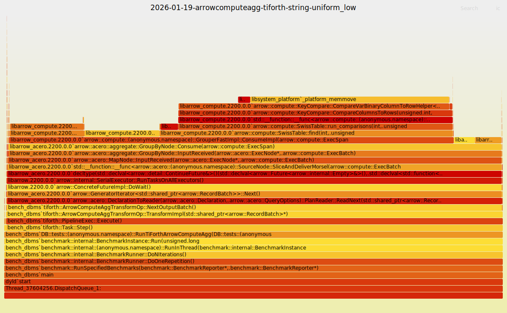
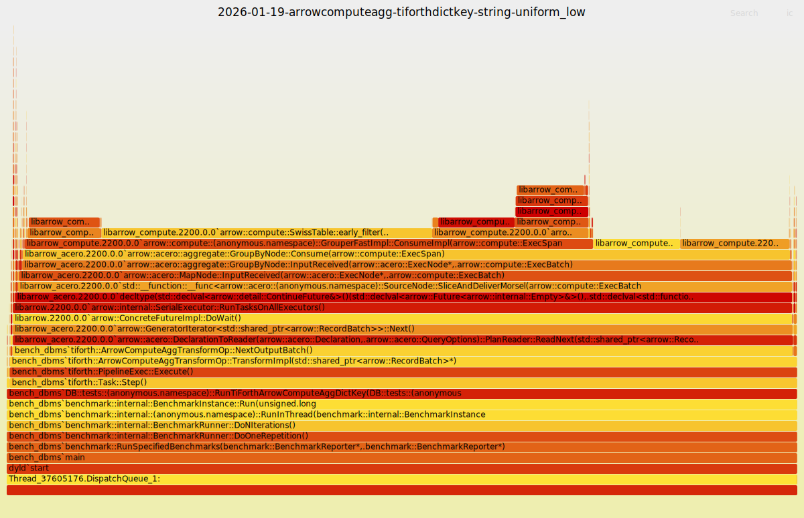

# ArrowComputeAgg: Why string keys are slower (profiling, 2026-01-19)

This doc investigates why `ArrowComputeAgg/TiForth` is slower than `ArrowComputeAgg/Native` for **string group keys** in `dbms/bench_dbms`, and why `TiForthDictKey` (shared dictionary) is much faster.

Benchmark context and raw throughput tables are in:

- `docs/design/2026-01-19-arrow-compute-agg-benchmark-report.md`

## TL;DR

- **TiForth (Arrow/Acero) with raw string keys** spends most CPU in Arrow’s **group-by key hashing + varbinary key comparisons**, dominated by:
  - `arrow::compute::Hashing32::HashVarLenImp`
  - `arrow::compute::KeyCompare::CompareVarBinaryColumnToRowHelper`
  - `_platform_memmove`/`memcpy` within the compare path
- **TiFlash Native** spends CPU mostly in its **string hash-map** insertion/find path:
  - `DB::Aggregator::emplaceOrFindKey` + `DB::ColumnsHashing::KeyStringBatchHandlerBase::prepareNextBatchType`
- **TiForthDictKey** removes most varbinary comparison work by turning keys into **int dictionary codes** (stable dictionary across batches), shifting time to:
  - `arrow::compute::SwissTable::*` + grouped aggregate update kernels
- **TiForthStableDictKey** (TiForth `stable_dictionary_encode_binary_keys`) works around Arrow’s “unifying differing dictionaries” limitation by encoding varlen keys into stable `int32` codes (`dictionary_encode` + `DictionaryUnifier`) and decoding on output; in the current microbench it is still slower than raw keys because encoding dominates.

Practical conclusion:

- Arrow/Acero grouped aggregation is fast when keys are **fixed-width**, but raw `BinaryArray` keys incur substantial per-row varlen hash/compare overhead.
- A shared-dictionary representation can eliminate the bottleneck (`TiForthDictKey`), but Arrow/Acero cannot “unify differing dictionaries” across batches; TiForth’s stable-code workaround exists but is not a win (yet) for these string-key cases.

## Profiling method

Platform: macOS. Profiler: `sample` + FlameGraph scripts.

1) Build:

```bash
ninja -C cmake-build-release bench_dbms
```

2) Run and sample a single benchmark for ~20s, while sampling stacks for 10s:

```bash
bench=cmake-build-release/dbms/bench_dbms
filter='^ArrowComputeAgg/TiForth/kString_vInt64_uniform_low_rows262144_blk65536_groups16$'

$bench --benchmark_filter=\"$filter\" --benchmark_min_time=20 & pid=$!
sleep 2
sample \"$pid\" 10 -file /tmp/sample.txt
wait \"$pid\"
```

3) Convert to flamegraph (using https://github.com/brendangregg/FlameGraph):

```bash
awk -f /tmp/FlameGraph/stackcollapse-sample.awk /tmp/sample.txt > /tmp/sample.folded
perl /tmp/FlameGraph/flamegraph.pl --title \"profile\" --countname \"samples\" /tmp/sample.folded > out.svg
```

## Collected flamegraphs (string/uniform_low)

All profiles below sample the `kString_vInt64_uniform_low_rows262144_blk65536_groups16` case.

### Native



### TiForth (raw string keys)



### TiForthDictKey (shared dictionary keys)



## What the profiles show

### TiForth (raw `BinaryArray` keys): dominated by varlen key compare/hash

Hot stack (representative from `sample`):

```
GroupByNode::Consume
  GrouperFastImpl::ConsumeImpl
    SwissTable::find / run_comparisons
      KeyCompare::CompareColumnsToRows
        KeyCompare::CompareVarBinaryColumnToRowHelper
          _platform_memmove
```

Leaf hotspots (10s sample, approximate from folded stacks):

- `_platform_memmove` (inside `CompareVarBinaryColumnToRowHelper`)
- `arrow::compute::Hashing32::HashVarLenImp`
- `arrow::compute::KeyCompare::CompareVarBinaryColumnToRowHelper`
- `arrow::compute::SwissTable::early_filter`

Interpretation:

- Every input row needs (1) hash of the key bytes and (2) equality compare against candidate rows in the group table.
- For varlen keys this becomes a tight loop over offsets+bytes + memmove/memcpy/memcmp-style operations.

### TiFlash Native: dominated by its string hash-map batch hashing + key insertion/find

Native hot path is concentrated in:

- `DB::Aggregator::handleOneBatch<...AggregationMethodString...>`
- `DB::Aggregator::emplaceOrFindKey<...AggregationMethodString...>`
- `DB::ColumnsHashing::KeyStringBatchHandlerBase::prepareNextBatchType<...>`

Interpretation:

- TiFlash does a specialized string-key pipeline: batch hashing into a `PODArray<UInt64>` and a specialized `StringHashMap`/arena key holder.
- The per-row overhead is largely “hash + table probe” without Arrow’s row-table varbinary compare machinery.

### TiForthDictKey: varbinary compare disappears; grouped update becomes visible

With a shared `DictionaryArray` key column, the profile no longer shows `CompareVarBinary*` and heavy memmove.

Instead, time shifts to:

- `arrow::compute::SwissTable::early_filter/find/extract_group_ids`
- grouped aggregate update kernels (`GroupedReducingAggregator`, `GroupedCountImpl`, etc.)

Interpretation:

- Keys behave like fixed-width integers; grouping becomes a fast hash/probe on integer codes.

## Root cause hypothesis

The slowdown is primarily **representation + algorithmic overhead** in Arrow’s grouping for varlen keys:

- `BinaryArray` keys require **varlen hashing** and **varlen equality comparisons** against an internal row table of unique keys.
- The Arrow grouper implementation uses a Swiss-table + row-table layout; for varlen keys this triggers frequent varbinary compare logic (`CompareVarBinaryColumnToRowHelper`) and memmove/memcpy in the hot loop.

## Why TiFlash native is faster than Arrow/Acero for short strings

The benchmark’s `kString` keys are **very short** (e.g. `"k0"`, `"k1"`, ...). This matters because TiFlash’s native
aggregation uses a **string-specialized hash table** that turns short strings into fixed-width keys, while Arrow treats
all strings as varlen.

### TiFlash: `StringHashTable` small-string specialization + saved-hash for long strings

TiFlash’s `StringHashMap` is backed by `StringHashTable` which dispatches string keys into multiple subtables:

- **1..8 bytes** → `StringKey8` (`UInt64`)
- **9..16 bytes** → `StringKey16` (`UInt128`)
- **17..24 bytes** → `StringKey24` (3×`UInt64`)
- **>= 25 bytes** → `StringRef` table with **saved hash**

Key properties:

- Short strings are materialized into fixed-width integers once (`memcpy` + bit-shift mask) and then compared by
  integer equality (no varbinary loop / memcmp).
- Hashing for the short-string tables uses **CRC32 on 8-byte chunks** when available (SSE4.2 / ARM CRC), otherwise
  CityHash on the fixed-width key.
- Long strings use a `HashMapCellWithSavedHash` (saved `size_t` hash) so probing can reject mismatches quickly before
  touching key bytes.

Relevant code:

- `dbms/src/Common/HashTable/StringHashTable.h` (`dispatch()` 1..24B → StringKey8/16/24; >=25B → StringRef)
- `dbms/src/Common/HashTable/StringHashMap.h` (`StringHashMapCell<StringRef, ...>` uses `HashMapCellWithSavedHash`)
- `dbms/src/Common/HashTable/HashMap.h` (`HashMapCellWithSavedHash`)

### Arrow/Acero: varlen hash + row-table varbinary compare for every row

Arrow’s grouped aggregation (Acero `GroupByNode`) uses `GrouperFastImpl`:

- Hashing: `Hashing32::HashMultiColumn` → `HashVarLenImp` scans varlen payload (16-byte “stripe” hashing).
- Lookup: `SwissTable::find` uses an equality callback which, for varlen keys, calls
  `KeyCompare::CompareVarBinaryColumnToRowHelper`.

For short strings, the per-row overhead is dominated by the *framework* around comparing varlen keys:

- decode varbinary offset/length from the row-table encoding (`first_varbinary_offset_and_length` / `nth_varbinary...`)
- compare 8 bytes at a time using `SafeLoad` (often compiles to `memcpy`/`memmove` for unaligned loads)
- allocate and update temporary match byte/bit vectors per minibatch

Relevant code:

- `cmake-build-debug/_deps/arrow-src/cpp/src/arrow/compute/row/grouper.cc` (`GrouperFastImpl::ConsumeImpl`)
- `cmake-build-debug/_deps/arrow-src/cpp/src/arrow/compute/key_hash_internal.cc` (`Hashing32::HashVarLenImp`)
- `cmake-build-debug/_deps/arrow-src/cpp/src/arrow/compute/row/compare_internal.cc` (`CompareVarBinaryColumnToRowHelper`)

### Practical takeaway

TiFlash wins for “short string key” workloads mainly because the key becomes *effectively fixed-width* (<=24B), so both
hashing and equality checks avoid the varlen path. Arrow/Acero has no equivalent “short string key → integer” fast path
in the grouper today, so it pays varlen hash + varlen compare costs even when keys are tiny.

Why dict keys help:

- Feeding a `DictionaryArray` with a **stable dictionary** effectively turns the group key into a fixed-width integer index, avoiding the varbinary compare loop.

Why per-batch dictionary-encode doesn’t work today:

- Arrow/Acero currently errors on multi-batch input with differing dictionaries (`NotImplemented: Unifying differing dictionaries`), so streaming inputs where the dictionary grows/changes cannot simply feed per-batch `DictionaryArray` to `GroupByNode`.
- TiForthStableDictKey works around this by converting per-batch dictionaries into stable `int32` codes and aggregating on the codes, but this adds extra encoding work (currently slower than raw varlen keys in `bench_dbms`).

## Follow-ups (actionable)

- Short term (bench/prototype): keep `TiForthDictKey` as a proof that “fixed-width group keys are fast” and use it to isolate remaining overheads.
- Medium term (TiForth operator): keep default string-key fallback to TiForth `HashAggTransformOp`; only use Arrow/Acero when keys are already fixed-width (e.g. upstream dictionary/low-card encoding).
- Long term (Arrow): upstream or track support for **dictionary unification** and/or “short-string → fixed-width key” fast paths inside Grouper/GroupByNode.
